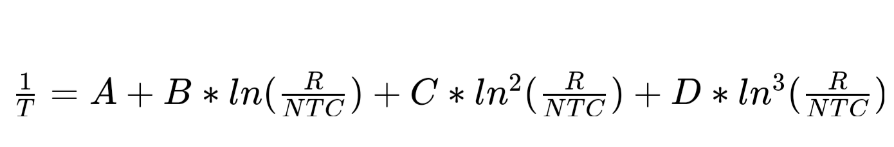
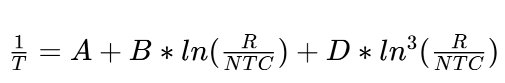
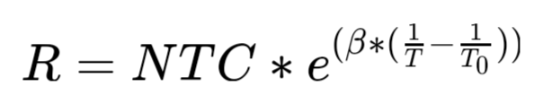
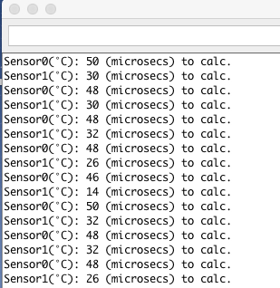
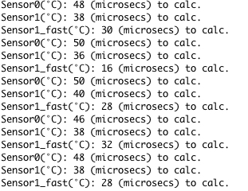
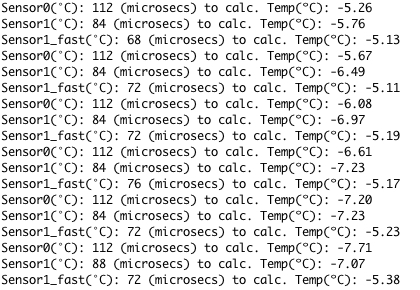
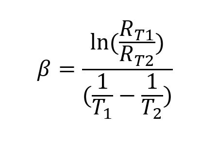
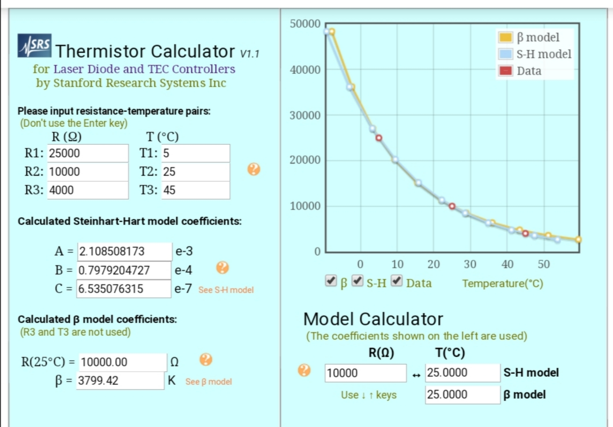

# SteinhartHart library #

Library to used to derive a precise temperature of a thermistor, fastest Calc. (14~29% faster than others) 

## Introduction ##

The thermistor changes its resistance drastically with temperature. 
"Thermistor" word comes from “thermally sensitive resistor". The resistance of ordinary 
materials rises slightly as temperature rises, whereas NTC (negative 
temperature coefficient) thermistors exhibit a sharp decrease in resistance. 
For information about thermistor see manufacturer information. 
Shibaura manufacturer has a lot of [thecnical information](https://www.shibauraelectronics.com/products/technical/index.html) 
about NTC thermistors. 

The Steinhart-Hart equation is the most widely used tool to interpolate 
the NTC thermistor resistance/temperature curve. It is a third order
polynomial ecuation which provides very good curve fitting.

In the standard Steinhart-Hart equation the C parameter is set to zero.
However, some manufacturers use all 4 coefficients. So we can use standard Steinhart-Hart
ecuation with 3 coefficients. 

where:
* **T** is the temperature (in kelvins),
* **R** is the resistance at T (in ohms),
* **A**, **B**, and **D** are the Steinhart–Hart coefficients, which vary depending on the type and model of thermistor and the temperature range of interest. 
These can usually be found in the data sheet.

## Other expressions ##

Other form of the equation is the use of B (beta) parameter 

where:
* **T** is the temperature (in kelvins)
* **T0** is 298'15 ºK (25 ºC)
* **R** is the resistance at T (in ohms),
* **NTC** is the resistence of thermistor at 298'15 ºK (25 ºC) 
* **beta** are the Steinhart-Hart beta coefficient that vary depending on the type and model of Thermistor. 
These can usually be found in the data sheet.

## More Information ##

[Thermistor](https://en.wikipedia.org/wiki/Thermistor?wprov=sfla1) is the principal element of temperature sensor.

[Look here](https://en.wikipedia.org/wiki/Steinhart–Hart_equation?wprov=sfla1) for more information about Steinhart-Hart ecuations. 

You can learn more about [temperature coefficient here](https://en.wikipedia.org/wiki/Temperature_coefficient?wprov=sfla1). 

More information:
* [Arrhenius equation](https://en.wikipedia.org/wiki/Arrhenius_equation?wprov=sfla1). 
* [Q10 temperature coefficient](https://en.wikipedia.org/wiki/Q10_%28temperature_coefficient%29). 

## Fast Calc ##

In this library, it is take the beta ecuation and calculate temperature of the thermistor from it. 

	 R     (beta/T - beta/298,15)                  beta   beta        ln(R/NTC)   1     1
	--- = e                         ,, ln(R/NTC) = ---- - ------  ,,  --------- = - - ------- ,,
	NTC                                             T     298,15        beta      T   298,15
 
	1      1     ln(R) - ln(NTC)        1     ln(R/NTC)     beta + 298,15 * ln(R/NTC)
	- = ------ + ---------------  =  ------ + ---------  =  -------------------------
	T   298,15        beta           298,15     beta             beta * 298,15

So we can solve using this formula:

	          beta * T0
	T = ----------------------
	     beta + T0 * ln(R/NTC)
	
	(T0 = 298,15)

The library is 14-29% faster than others libraries to
get temperature from Thermistor if we compare this library 
with libraries based on beta equation. And it depends on the 
board used. Tested on LGT8F328P-SOPP, LGT8F328P-QF32 and Arduino pro mini boards. 
If it is compared Fast Calc with Steinhart-Hart three orden equation, 
it is 35-44% faster, depends on microcontroller used. See example for test. 

Testing **sensor0** Steinhart-Hart three orden equation, **sensor1** Fast Calc equation. LGT8F328P-SOPP board. (32 MHz) 

 
Testing **sensor0** Steinhart-Hart three orden equation, **sensor1** beta equation and **sensor1_fast** Fast Calc equation. LGT8F328P-QF32 board. (32 MHz) 

Testing **sensor0** Steinhart-Hart three orden equation, **sensor1** beta equation and **sensor1_fast** Fast Calc equation. Atmega328p board. (16 MHz) 

## Calculation of beta ##

Beta is measured in degrees Kelvin (K) and is computed based on this equation:

Where:
* **Rt1** = Resistance at Temperature 1 (ohms) 
* **Rt2** = Resistance at Temperature 2 (ohms) 
* **T1** = Temperature 1 in (Kelvin)
* **T2** = Temperature 2 in (Kelvin)

How to Calc beta of NTC Thermistor, you can [see this page.](https://www.ametherm.com/thermistor/ntc-thermistor-beta) 

 

Using the [Thermistor Calculator V1.1](https://www.thinksrs.com/downloads/programs/therm%20calc/ntccalibrator/ntccalculator.html) 
you can de termine the unknowns parameters of a thermistor. 

For more information about NTC thermistors and Steinhart-Hart equation to calc the parameters using three pairs of values (temperature, NTC resistence) see [NTC Thermistors Steinhart and Hart Equation](https://www.ametherm.com/thermistor/ntc-thermistors-steinhart-and-hart-equation)

## How to use Thermistor as temperature sensor ##

Thermistor values denote their resistance at 25°C. A popular type would
be an NTC 10K which would give roughly 10 kOhms at that temperature point.

Although there are ways to calculate the coefficients yourself experimentally
it might be cheaper and easier to just buy a thermistor with known specs. This page 
can help to calculate thats coefficients. [Thermistor Calculator V1.1](https://www.thinksrs.com/downloads/programs/therm%20calc/ntccalibrator/ntccalculator.html).

To get readings from a thermistor into your Arduino you will have to use
a conventional voltage divider circuit.

	              ____         ____
	VCC +5 o-----|____|---+---|____|---o GND
	            NTC 10K   |     10K
	                      | 
	PIN A0 o--------------+

## Installation ##

For a tutorial on how to install new libraries for use with the Arduino
development environment please refer to the following website:
http://www.arduino.cc/en/Reference/Libraries

## License ##

This file is part of SteinhartHart Library.

SteinhartHart Library is free software: you can redistribute it and/or modify it under the terms of the GNU General Public License as published by the Free Software Foundation, either version 3 of the License, or (at your option) any later version.

SteinhartHart lLibrary is distributed in the hope that it will be useful, but WITHOUT ANY WARRANTY; without even the implied warranty of MERCHANTABILITY or FITNESS FOR A PARTICULAR PURPOSE.  See the GNU General Public License for more details.

You should have received a copy of the GNU General Public License along with SteinhartHart Library.  If not, see <https://www.gnu.org/licenses/>.

## Authors ##

Copyright © 2021 Francisco Rafael Reyes Carmona. 
Contact me: rafael.reyes.carmona@gmail.com 

This is a fork of SteinhartHart work by [Andreas Tacke](https://github.com/fiendie/). If you want to know more about this work, visit the [Github page](https://github.com/fiendie/SteinhartHart).

## Credits ##

Celsius icon at the beginning is from [Flaticon.es](https://www.flaticon.es) designed by [Those Icons](https://www.flaticon.es/autores/those-icons) 
and licensed by [free license](img/licencia-37862535.pdf). 
